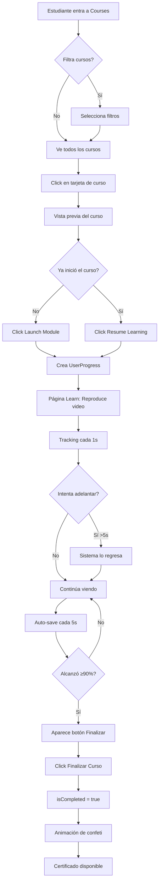
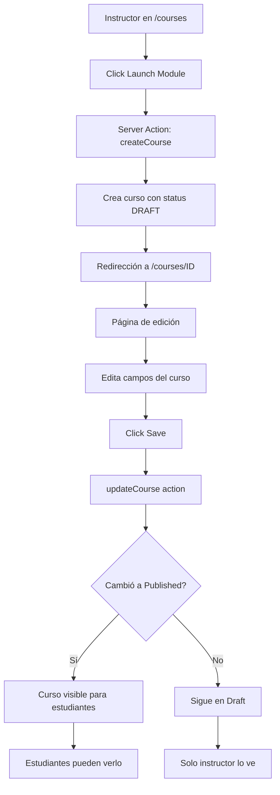
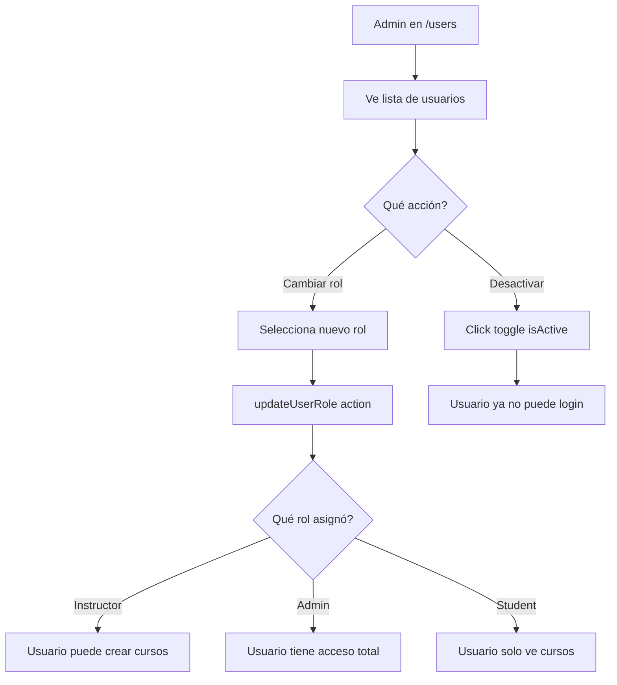

# LMS PRO - Sistema de Gestión de Aprendizaje

**Creado por Andrez Hernandez**

---

## 📚 Índice

1. [Introducción](#introducción)
2. [Características Principales](#características-principales)
3. [Roles y Permisos](#roles-y-permisos)
4. [Arquitectura del Sistema](#arquitectura-del-sistema)
5. [Base de Datos](#base-de-datos)
6. [Módulos del Sistema](#módulos-del-sistema)
7. [Funcionalidades por Rol](#funcionalidades-por-rol)
8. [Flujos de Trabajo](#flujos-de-trabajo)
9. [Configuración Técnica](#configuración-técnica)

---

## 🎯 Introducción

**LMS PRO** es un sistema de gestión de aprendizaje (Learning Management System) moderno y avanzado diseñado para facilitar la educación en línea. El sistema permite a los instructores crear y administrar cursos basados en videos de YouTube, mientras que los estudiantes pueden acceder a ellos, realizar seguimiento de su progreso y completar certificaciones.

### Tecnologías Utilizadas

- **Framework**: Next.js 16 con React
- **Base de Datos**: SQLite con Prisma ORM
- **Autenticación**: NextAuth.js
- **Estilos**: CSS Vanilla (Dark Theme)
- **Video**: YouTube IFrame API
- **Lenguaje**: TypeScript

---

## ✨ Características Principales

### Para Todos los Usuarios
- 🔐 **Sistema de autenticación seguro** con email y contraseña
- 🎨 **Interfaz moderna** con tema oscuro premium
- 📱 **Diseño responsive** que funciona en desktop, tablet y móvil
- 🚀 **Rendimiento optimizado** con Next.js 16 y Turbopack

### Para Estudiantes
- 📺 **Reproductor de video integrado** con YouTube
- 📊 **Seguimiento de progreso** en tiempo real
- 🎯 **Sistema de certificación** al completar cursos
- 🔍 **Filtros avanzados** para encontrar cursos
- ⏱️ **Reanudación automática** del último punto visto
- 🚫 **Prevención de adelanto** para garantizar aprendizaje completo

### Para Instructores
- ➕ **Creación de cursos** con título, descripción e imágenes
- 🎬 **Integración con YouTube** para contenido de video
- 📝 **Gestión completa** de cursos (crear, editar, archivar)
- 📈 **Estados de publicación** (Draft, Published, Archived)

### Para Administradores
- 👥 **Gestión de usuarios** completa
- 🔑 **Asignación de roles** (Student, Instructor, Admin)
- ✅ **Activación/desactivación** de cuentas
- 📊 **Vista general** de todos los cursos y usuarios

---

## 👥 Roles y Permisos

El sistema cuenta con tres roles principales, cada uno con permisos específicos:

### 🎓 STUDENT (Estudiante)

**Permisos:**
- Ver cursos publicados
- Inscribirse y ver videos de cursos
- Hacer seguimiento de su progreso
- Completar cursos y obtener certificados
- Filtrar cursos por estado de progreso
- Editar su propio perfil

**Restricciones:**
- No puede crear cursos
- No puede ver cursos en Draft o Archived
- No puede administrar otros usuarios
- Solo ve sus propios datos de progreso

### 👨‍🏫 INSTRUCTOR (Instructor)

**Permisos:**
- Todos los permisos de Student
- Crear nuevos cursos
- Editar sus propios cursos
- Publicar/archivar cursos
- Ver lista de sus cursos creados
- Gestionar contenido (título, descripción, video, imagen)

**Restricciones:**
- No puede editar cursos de otros instructores
- No puede administrar usuarios
- No tiene acceso a métricas globales del sistema

### 👨‍💼 ADMIN (Administrador)

**Permisos:**
- Todos los permisos de Instructor
- Ver todos los cursos del sistema
- Gestionar todos los usuarios
- Cambiar roles de usuarios
- Activar/desactivar cuentas de usuario
- Editar cualquier curso
- Ver información global del sistema

**Capacidades especiales:**
- Asignar roles: Student, Instructor, Admin
- Desactivar cuentas sin eliminarlas
- Ver todos los cursos independientemente del estado

---

## 🏗️ Arquitectura del Sistema

### Estructura de Carpetas

```
my-app/
├── app/                          # Directorio principal de Next.js
│   ├── dashboard/                # Páginas del dashboard
│   │   ├── courses/              # Módulo de cursos
│   │   │   ├── [courseId]/       # Páginas de curso individual
│   │   │   │   ├── preview/      # Vista previa del curso
│   │   │   │   ├── learn/        # Página de reproducción
│   │   │   │   └── page.tsx      # Edición de curso
│   │   │   ├── actions.ts        # Server actions
│   │   │   └── page.tsx          # Lista de cursos
│   │   ├── profile/              # Perfil de usuario
│   │   ├── users/                # Gestión de usuarios (Admin)
│   │   └── layout.tsx            # Layout del dashboard
│   ├── api/                      # API Routes
│   └── auth/                     # Autenticación
├── prisma/                       # Configuración de base de datos
│   └── schema.prisma             # Schema de Prisma
├── lib/                          # Utilidades y helpers
│   ├── db.ts                     # Cliente de Prisma
│   └── youtube.ts                # Helpers de YouTube
└── public/                       # Archivos estáticos
```

### Componentes Principales

#### 1. **Player Component** (`learn/Player.tsx`)
- Reproduce videos de YouTube usando YouTube IFrame API
- Rastrea el progreso en tiempo real (cada segundo)
- Guarda progreso cada 5 segundos en la base de datos
- Previene adelantar el video más de 5 segundos
- Muestra barra de progreso en tiempo real
- Permite completar curso cuando alcanza ≥90% de progreso

#### 2. **ProgressDisplay Component** (`preview/ProgressDisplay.tsx`)
- Componente del lado del cliente
- Obtiene la duración real del video de YouTube
- Calcula porcentaje de progreso preciso
- Muestra barra de progreso animada
- Sincronizado con el Player

#### 3. **Course Cards** (`courses/page.tsx`)
- Muestra cursos en formato de tarjetas
- Filtros por título, nivel, estado, y progreso
- Vista diferente para estudiantes e instructores
- Usa miniaturas de YouTube como fallback
- Estados visuales: Disponible, Cursando, Terminado

---

## 🗄️ Base de Datos

### Tecnología: SQLite + Prisma ORM

El sistema utiliza **SQLite** como base de datos, lo que lo hace:
- ✅ Fácil de configurar (no requiere servidor)
- ✅ Portátil (archivo único)
- ✅ Ideal para desarrollo y producción pequeña-mediana
- ✅ Sin configuración extra

### Modelos de Datos

#### **User** (Usuario)
```prisma
model User {
  id            String    @id @default(cuid())
  name          String?
  email         String    @unique
  password      String?
  image         String?
  role          String    @default("STUDENT")
  isActive      Boolean   @default(true)
  createdAt     DateTime  @default(now())
  updatedAt     DateTime  @updatedAt
  
  coursesCreated Course[] @relation("CreatedCourses")
  progress       UserProgress[]
}
```

**Campos importantes:**
- `role`: Define el nivel de acceso (STUDENT, INSTRUCTOR, ADMIN)
- `isActive`: Permite desactivar usuarios sin eliminarlos
- `email`: Único, usado para login
- `password`: Hash de la contraseña (bcrypt)

#### **Course** (Curso)
```prisma
model Course {
  id               String   @id @default(cuid())
  title            String
  shortDescription String?
  description      String?
  videoUrl         String?
  coverImage       String?
  level            String   @default("BEGINNER")
  status           String   @default("DRAFT")
  createdById      String
  createdAt        DateTime @default(now())
  updatedAt        DateTime @updatedAt
  
  createdBy        User     @relation("CreatedCourses", fields: [createdById], references: [id])
  progress         UserProgress[]
}
```

**Campos importantes:**
- `videoUrl`: URL de YouTube del video del curso
- `level`: BEGINNER, INTERMEDIATE, ADVANCED
- `status`: DRAFT (borrador), PUBLISHED (publicado), ARCHIVED (archivado)
- `coverImage`: URL de imagen de portada (opcional, usa thumbnail de YouTube como fallback)

#### **UserProgress** (Progreso del Usuario)
```prisma
model UserProgress {
  id           String   @id @default(cuid())
  userId       String
  courseId     String
  playbackTime Float    @default(0)
  isCompleted  Boolean  @default(false)
  createdAt    DateTime @default(now())
  updatedAt    DateTime @updatedAt
  
  user         User     @relation(fields: [userId], references: [id], onDelete: Cascade)
  course       Course   @relation(fields: [courseId], references: [id], onDelete: Cascade)
  
  @@unique([userId, courseId])
}
```

**Campos importantes:**
- `playbackTime`: Segundos vistos del video
- `isCompleted`: `true` cuando el usuario marca el curso como completado
- `@@unique([userId, courseId])`: Un usuario solo puede tener un progreso por curso

### Conexión a la Base de Datos

**Archivo**: `.env`
```env
DATABASE_URL="file:./dev.db"
```

**Inicialización**: `lib/db.ts`
```typescript
import { PrismaClient } from '@prisma/client'

const globalForPrisma = globalThis as unknown as {
  prisma: PrismaClient | undefined
}

export const db = globalForPrisma.prisma ?? new PrismaClient()

if (process.env.NODE_ENV !== 'production') globalForPrisma.prisma = db
```

**Comandos útiles:**
```bash
# Crear migración
npx prisma migrate dev --name descripcion_cambio

# Abrir Prisma Studio (interfaz visual)
npx prisma studio

# Generar cliente de Prisma
npx prisma generate

# Resetear base de datos
npx prisma migrate reset
```

---

## 📦 Módulos del Sistema

### 1. **Módulo de Autenticación**

**Ubicación**: `app/auth/`

**Funcionalidades:**
- Login con email y contraseña
- Sesiones con NextAuth.js
- Protección de rutas
- Redirección automática según rol

**Flujo de autenticación:**
1. Usuario ingresa email y contraseña
2. Sistema valida credenciales con bcrypt
3. NextAuth crea sesión
4. Usuario es redirigido a `/dashboard`

### 2. **Módulo de Cursos**

**Ubicación**: `app/dashboard/courses/`

#### Páginas principales:

**a) Lista de Cursos** (`page.tsx`)
- Vista de tarjetas con todos los cursos
- Filtros por título, nivel, estado, progreso
- Botón "Launch Module" para crear curso (instructores)
- Estados visuales por progreso (estudiantes)

**b) Vista Previa** (`[courseId]/preview/page.tsx`)
- Información detalla del curso
- Imagen/thumbnail del video
- Estado del progreso (con ProgressDisplay)
- Botón "Launch Module" o "Resume Learning"
- Información del creador

**c) Reproductor** (`[courseId]/learn/page.tsx`)
- Video de YouTube integrado
- Barra de progreso en tiempo real
- Botón "Finalizar Curso" (cuando ≥90%)
- Prevención de adelanto
- Auto-save cada 5 segundos

**d) Edición** (`[courseId]/page.tsx`)
- Formulario para editar curso
- Campos: título, descripción corta, descripción larga, videoUrl, coverImage, level, status
- Solo accesible por creador o admin

### 3. **Módulo de Usuarios** (Solo Admin)

**Ubicación**: `app/dashboard/users/`

**Funcionalidades:**
- Lista de todos los usuarios
- Filtrar por nombre o email
- Cambiar rol de usuario
- Activar/desactivar cuentas
- Ver información de cada usuario

### 4. **Módulo de Perfil**

**Ubicación**: `app/dashboard/profile/`

**Funcionalidades:**
- Ver información personal
- Editar nombre
- Cambiar contraseña
- Ver rol asignado

---

## 🎭 Funcionalidades por Rol

### Estudiante (STUDENT)

#### En el Dashboard
```
┌─────────────────────────────────────┐
│  📚 Courses                         │
│  👤 Profile                         │
└─────────────────────────────────────┘
```

**Cursos disponibles:**
1. **Ver cursos publicados**
   - Solo ve cursos con `status: PUBLISHED`
   - No ve Draft ni Archived

2. **Filtrar cursos**
   - Por título (búsqueda)
   - Por nivel (Beginner, Intermediate, Advanced)
   - **Por progreso**:
     - **Todos**: Cursando → Disponibles → Terminados
     - **Cursando**: Solo cursos iniciados no completados
     - **Terminados**: Solo cursos completados

3. **Ver curso**
   - Click en tarjeta → Vista previa
   - Muestra: título, descripción, nivel, creador
   - **Estado del progreso**:
     - Sin iniciar: "Available" (azul)
     - En progreso: "Cursando X%" (amarillo) + tiempo visto
     - Completado: "Terminado" (verde)

4. **Tomar curso**
   - Click "Launch Module" o "Resume Learning"
   - Se crea registro en `UserProgress` al abrir
   - Video carga en último segundo visto (`playbackTime`)

5. **Seguimiento de progreso**
   - Progreso se guarda cada 5 segundos
   - Barra en el header muestra % en tiempo real
   - No puede adelantar más de 5 segundos
   - Puede retroceder libremente

6. **Completar curso**
   - Cuando alcanza ≥90% del video
   - Aparece botón "Finalizar Curso"
   - Click → marca `isCompleted: true`
   - Muestra animación de confeti

#### En el Perfil
- Ver su nombre, email, rol
- Editar nombre
- Cambiar contraseña

---

### Instructor (INSTRUCTOR)

**Herramientas adicionales:**

1. **Crear curso**
   - Botón "Launch Module" en `/dashboard/courses`
   - Crea curso con status: DRAFT
   - Redirección automática a edición

2. **Editar curso**
   - Solo puede editar sus propios cursos
   - Campos editables:
     - Título *
     - Descripción corta
     - Descripción larga
     - URL de video de YouTube
     - URL de imagen de portada
     - Nivel (Beginner/Intermediate/Advanced)
     - Estado (Draft/Published/Archived)

3. **Gestionar cursos**
   - **Draft**: Curso visible solo para él
   - **Published**: Visible para todos los estudiantes
   - **Archived**: Oculto para estudiantes, visible para él

4. **Vista de cursos**
   - Ve solo sus cursos creados
   - Puede filtrar por título, nivel, estado
   - Tarjetas muestran estado de publicación

---

### Administrador (ADMIN)

**Herramientas de poder:**

1. **Gestión de usuarios**
   - Acceso a `/dashboard/users`
   - Ver todos los usuarios del sistema
   - **Cambiar rol**:
     - De Student → Instructor
     - De Instructor → Admin
     - De Admin → Student
   - **Activar/Desactivar cuentas**:
     - `isActive: false` previene login
     - No elimina datos del usuario

2. **Gestión de cursos**
   - Ve **todos** los cursos (de todos los instructores)
   - Puede editar cualquier curso
   - Ve cursos en todos los estados (Draft, Published, Archived)
   - Puede cambiar estado de cualquier curso

3. **Vista global**
   - Estadísticas de todos los cursos
   - Información de uso del sistema
   - Filtros avanzados

---

## 🔄 Flujos de Trabajo

### Flujo: Estudiante toma un curso



### Flujo: Instructor crea un curso



### Flujo: Admin gestiona usuarios



---

## ⚙️ Configuración Técnica

### Variables de Entorno

**Archivo**: `.env`
```env
# Base de datos
DATABASE_URL="file:./dev.db"

# NextAuth
NEXTAUTH_SECRET="tu-secreto-aleatorio-aqui"
NEXTAUTH_URL="http://localhost:3000"
```

### Instalación

```bash
# 1. Clonar repositorio
git clone [url-del-repo]
cd my-app

# 2. Instalar dependencias
npm install

# 3. Configurar base de datos
npx prisma generate
npx prisma migrate dev

# 4. (Opcional) Seed con datos de prueba
npx prisma db seed

# 5. Ejecutar en desarrollo
npm run dev

# 6. Abrir en navegador
http://localhost:3000
```

### Comandos Útiles

```bash
# Desarrollo
npm run dev              # Inicia servidor de desarrollo
npm run build            # Build para producción
npm start                # Inicia en producción

# Base de datos
npx prisma studio        # Interfaz visual de BD
npx prisma migrate dev   # Crear migración
npx prisma generate      # Regenerar cliente

# Linting y formato
npm run lint             # Ejecutar linter
```

---

## 🎨 Diseño y Estética

### Paleta de Colores (Dark Theme)

```css
--bg-primary: #0b0e14      /* Fondo principal */
--bg-secondary: #0d1117    /* Fondo secundario */
--bg-tertiary: #161b22     /* Fondo terciario */
--border: #30363d          /* Bordes */
--text-primary: #c9d1d9    /* Texto principal */
--text-secondary: #8b949e  /* Texto secundario */
--text-muted: #484f58      /* Texto atenuado */

--blue: #2563eb            /* Acción primaria */
--green: #22c55e           /* Éxito/Completado */
--yellow: #eab308          /* En progreso */
--red: #ef4444             /* Error/Archivo */
```

### Principios de Diseño

1. **Dark First**: Tema oscuro profesional y moderno
2. **Glassmorphism**: Efectos de vidrio con `backdrop-blur`
3. **Micro-animations**: Transiciones suaves en hover
4. **Bordes redondeados**: `rounded-[2-3rem]` para modernidad
5. **Tipografía bold**: `font-black` para títulos y CTAs
6. **Spacing generoso**: `p-8`, `gap-6` para respiración

---

## 🔐 Seguridad

### Medidas Implementadas

1. **Autenticación**
   - Contraseñas hasheadas con bcrypt
   - Sesiones con NextAuth.js
   - Tokens seguros

2. **Autorización**
   - Verificación de rol en cada acción
   - Server Actions protegidos
   - Validación de permisos en frontend y backend

3. **Base de Datos**
   - Relaciones con `onDelete: Cascade`
   - Constraints únicos (`@@unique`)
   - Validación de tipos con Prisma

4. **Prevención de Ataques**
   - CSRF protection (NextAuth)
   - SQL Injection (Prisma)
   - XSS prevention (React)

---

## 📈 Funcionalidades Avanzadas

### 1. Sistema de Progreso Inteligente

**Características:**
- Tracking en tiempo real cada 1 segundo
- Guardado persistente cada 5 segundos
- Cálculo de porcentaje con duración real del video
- Prevención de skipping (máximo 5 segundos adelante)
- Sincronización entre preview y player

**Implementación técnica:**
```typescript
// Player actualiza maxSeen cuando avanza normalmente
if (now > maxSeenRef.current) {
    maxSeenRef.current = now
    setMaxSeen(now)  // Trigger re-render
}

// Calcula porcentaje
const percentage = Math.ceil((maxSeen / duration) * 100)

// Guarda cada 5 segundos
if (floorNow % 5 === 0) {
    updateProgress(courseId, floorNow)
}
```

### 2. YouTube Thumbnail Fallback

**Comportamiento:**
- Si un curso no tiene `coverImage`, automáticamente usa la miniatura del video de YouTube
- URL generada: `https://img.youtube.com/vi/{VIDEO_ID}/maxresdefault.jpg`
- Aplica en tarjetas de curso y vista previa
- Mejora visual sin modificar base de datos

**Código:**
```typescript
// lib/youtube.ts
export function getYouTubeThumbnail(videoUrl: string | null): string | null {
    const videoId = getYouTubeVideoId(videoUrl);
    if (!videoId) return null;
    return `https://img.youtube.com/vi/${videoId}/maxresdefault.jpg`;
}
```

### 3. Filtros Dinámicos

**Para estudiantes:**
- **Todos**: Ordenado por relevancia (Cursando → Disponibles → Completados)
- **Cursando**: Solo cursos con progreso pero no completados
- **Terminados**: Solo cursos con `isCompleted: true`

**Implementación:**
```typescript
if (params.progress === 'CURSANDO') {
    filteredCourses = courses.filter(c => 
        progressMap.has(c.id) && !progressMap.get(c.id)?.isCompleted
    )
} else if (params.progress === 'TERMINADOS') {
    filteredCourses = courses.filter(c => 
        progressMap.get(c.id)?.isCompleted
    )
}
```

---

## 🚀 Mejoras Futuras Sugeridas

1. **Analytics Dashboard**
   - Métricas de cursos más vistos
   - Tasas de completación
   - Tiempo promedio por curso

2. **Certificados**
   - Generación de PDF al completar
   - Diseño personalizado
   - Verificación con código QR

3. **Notificaciones**
   - Email cuando se publica nuevo curso
   - Recordatorios de cursos en progreso
   - Notificaciones de logros

4. **Quiz y Evaluaciones**
   - Exámenes al final de cada curso
   - Preguntas durante el video
   - Certificación condicionada a calificación

5. **Sistema de Comentarios**
   - Comentarios por curso
   - Preguntas y respuestas
   - Rating de cursos

6. **Categorías de Cursos**
   - Organización por temas
   - Rutas de aprendizaje
   - Cursos relacionados

---

## 📞 Soporte y Contacto

Para soporte técnico o reportar problemas:

**Creador**: Andrez Hernandez  
**Sistema**: LMS PRO v1.0  
**Última actualización**: Febrero 2026

---

## 📝 Notas Finales

Este sistema fue diseñado con las mejores prácticas de desarrollo moderno:

✅ **Código limpio y mantenible**  
✅ **Componentes reutilizables**  
✅ **TypeScript para type safety**  
✅ **Server Actions para mejor rendimiento**  
✅ **UI/UX moderna y profesional**  
✅ **Seguridad implementada en todas las capas**  

El sistema está listo para escalar y puede ser extendido fácilmente con nuevas funcionalidades según las necesidades del negocio.

---

**© 2026 LMS PRO - Creado por Andrez Hernandez**
